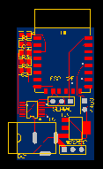

# firefly
`firefly` contains the firmware and PCB design for an LED controller that uses an 802.11 mesh network for data transfer and time synchronization.
# Software
# Hardware
The hardware was designed using [EasyEDA](https://easyeda.com). The json files in `pcb/` can be uploaded for editing.
## Board Render

